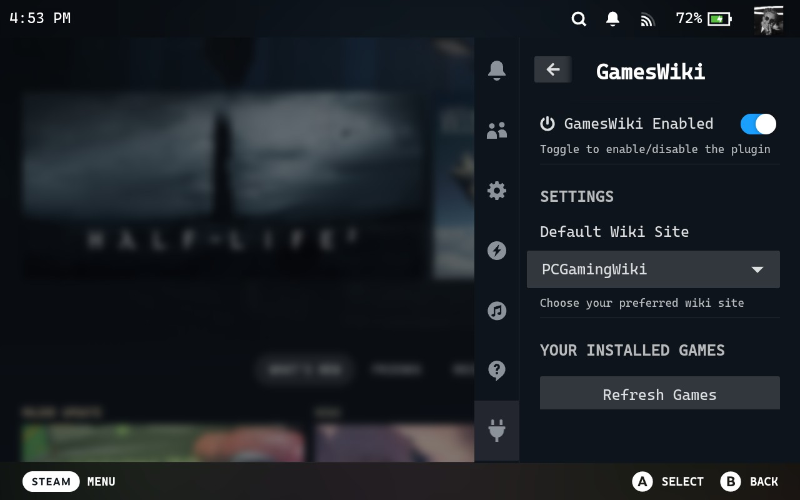
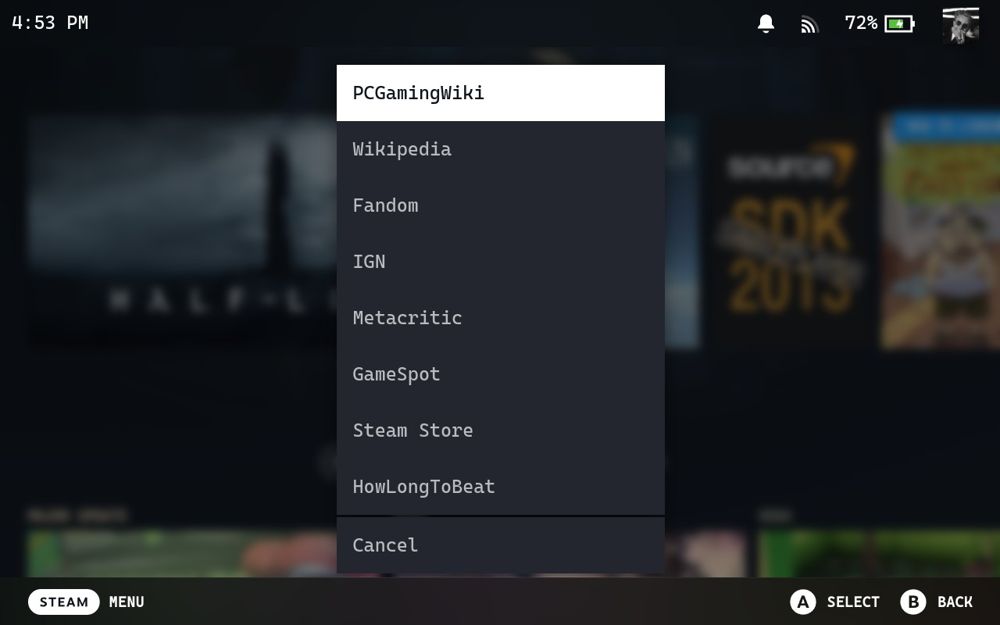
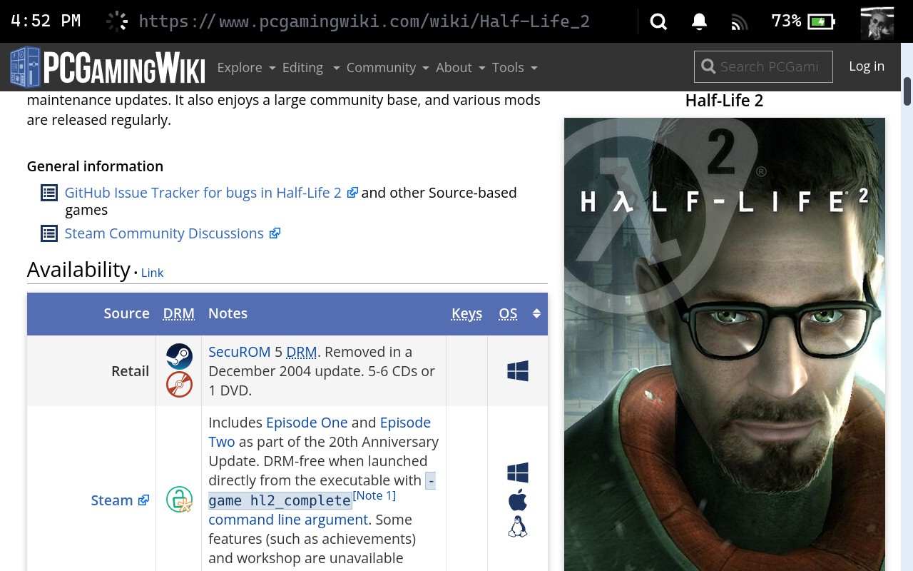

# GamesWiki - Decky Loader Plugin

A Steam Deck plugin that provides quick access to multiple game wiki sources for your installed games. Simply select your preferred wiki site and get instant access to game information, guides, and reviews.

## Screenshots

### Plugin Home Screen

*Main interface showing your installed games with quick wiki access*

### Wiki Site Selection

*Choose from 8 different wiki sites as your default*

### Sample Wiki Results

*Example of opening a game wiki from the plugin*

## Features

- **8 Wiki Sources**: Choose from PCGamingWiki, Wikipedia, Fandom, IGN, Metacritic, GameSpot, Steam Store, and HowLongToBeat
- **Installed Games Library**: Automatically scans your Steam library across all storage locations
- **Configurable Default**: Set your preferred wiki site and use it for all searches
- **Multiple Library Support**: Supports games installed on internal storage and SD cards
- **Duplicate Detection**: Smart filtering prevents showing the same game multiple times
- **Quick Access**: One-click wiki access for any of your installed games
- **Enable/Disable Toggle**: Turn the plugin on/off as needed

## Supported Wiki Sources

| Wiki Site | Best For | Example Use |
|-----------|----------|-------------|
| **PCGamingWiki** | Technical fixes, compatibility guides | Solving game crashes, performance issues |
| **Wikipedia** | General game information and history | Learning about game development, plot |
| **Fandom** | Community-driven detailed guides | Walkthoughs, character info, lore |
| **IGN** | Professional reviews and guides | Game reviews, strategy guides |
| **Metacritic** | Review aggregation and scores | Checking overall game ratings |
| **GameSpot** | Reviews and gaming news | Professional game reviews |
| **Steam Store** | Official game page | Purchase, system requirements |
| **HowLongToBeat** | Game completion time estimates | Planning your gaming sessions |

## Installation

### Prerequisites

- Steam Deck with Decky Loader installed
- Access to the Steam Deck's file system (via SSH recommended)

### Quick Installation (SSH)

1. **Copy Plugin Files** (from your computer):
   ```bash
   scp -r games-wiki-deploy/games-wiki deck@steamdeck:~/homebrew/plugins/
   ```

2. **Set Permissions** (on Steam Deck):
   ```bash
   ssh deck@steamdeck "chmod +x ~/homebrew/plugins/games-wiki/main.py"
   ```

3. **Restart Steam Deck**:
   ```bash
   ssh deck@steamdeck "sudo reboot"
   ```

### Manual Installation

1. **Download/Build the Plugin**:
   - Download the release files or build from source using: `pnpm build`

2. **Copy Files to Steam Deck**:
   Copy these files to `~/homebrew/plugins/games-wiki/` on your Steam Deck:
   
   **Required Files:**
   - `plugin.json` - Plugin metadata
   - `main.py` - Backend Python code  
   - `package.json` - Package information
   - `dist/index.js` - Compiled frontend code
   - `dist/index.js.map` - Source map
   - `README.md` - Documentation
   - `LICENSE` - License file

3. **Via MTP (Windows)**:
   - Connect Steam Deck via USB
   - Navigate to `This PC\Steam Deck\Home\homebrew\plugins\`
   - Create folder `games-wiki` and copy files

4. **Restart Decky Loader or Steam Deck**

## Usage

### First Time Setup

1. Open Decky Loader menu (⋯ button → plugins)
2. Find and open "GamesWiki" 
3. **Choose Your Default Wiki**: Use the Settings dropdown to select your preferred wiki site
4. **Enable the Plugin**: Toggle the enable switch if needed

### Daily Use

1. **Browse Your Games**: Your installed Steam games load automatically
2. **Click to Open**: Click any game's "Open in [Wiki]" button
3. **Change Wiki Site**: Use Settings dropdown to switch to different wiki sites anytime
4. **Refresh Games**: Use "Refresh Games" if you install new games

### Settings

- **Enable/Disable Toggle**: Turn the entire plugin on/off
- **Default Wiki Site**: Choose which wiki site to use for all game searches
- **Auto-Detection**: Plugin automatically finds games across all Steam libraries

## Technical Details

### How It Works

- **Game Detection**: Scans Steam library folders and parses ACF (App Cache Files)
- **Multi-Library Support**: Reads `libraryfolders.vdf` to find all Steam installations
- **Duplicate Prevention**: Smart filtering ensures each game appears only once
- **Real-time Updates**: Refresh button rescans your library for new installations

### File Structure
```
games-wiki/
├── plugin.json          # Plugin metadata
├── main.py              # Backend Python code
├── package.json         # NPM package info
├── README.md            # Documentation
├── LICENSE              # License file
├── screenshots/         # Plugin screenshots
├── src/
│   └── index.tsx       # Frontend React/TypeScript code
└── dist/
    ├── index.js        # Compiled frontend
    └── index.js.map    # Source map
```

## Development

### Building from Source

1. **Clone and Setup**:
   ```bash
   git clone [repository-url]
   cd games-wiki
   pnpm install
   ```

2. **Build**:
   ```bash
   pnpm build
   ```

3. **Deploy to Steam Deck**:
   ```bash
   scp -r games-wiki-deploy/games-wiki deck@steamdeck:~/homebrew/plugins/
   ```

### Development Notes

- Built with React, TypeScript, and Python
- Uses Decky Loader's UI components
- Follows Decky plugin development guidelines
- No external dependencies beyond Decky framework

## Troubleshooting

### Common Issues

**Games not showing up:**
- Click "Refresh Games" button
- Ensure games are fully installed (not just downloading)
- Check that Steam libraries are properly mounted

**Wiki site not changing:**
- Look for "Wiki Site Changed" toast notification
- Check browser console for any errors
- Try refreshing the plugin

**Plugin not appearing:**
- Verify all files are in `~/homebrew/plugins/games-wiki/`
- Check file permissions: `chmod +x ~/homebrew/plugins/games-wiki/main.py`
- Restart Steam Deck completely

## Contributing

Contributions welcome! Areas for improvement:
- Additional wiki sources
- Better game metadata extraction  
- UI/UX improvements
- Bug fixes and optimizations

## Developer Info

- **GitHub**: [KrishGaur1354](https://github.com/KrishGaur1354)
- **Twitter**: [@ThatOneKrish](https://x.com/ThatOneKrish)

## License

This project is licensed under the MIT License - see the LICENSE file for details.

## Acknowledgments

- Built using the [Decky Plugin Template](https://github.com/SteamDeckHomebrew/decky-plugin-template)
- Thanks to the Decky Loader team for the plugin framework
- Inspired by the need for quick game information access on Steam Deck

---

*Made with ❤️ by ThatOneKrish*
